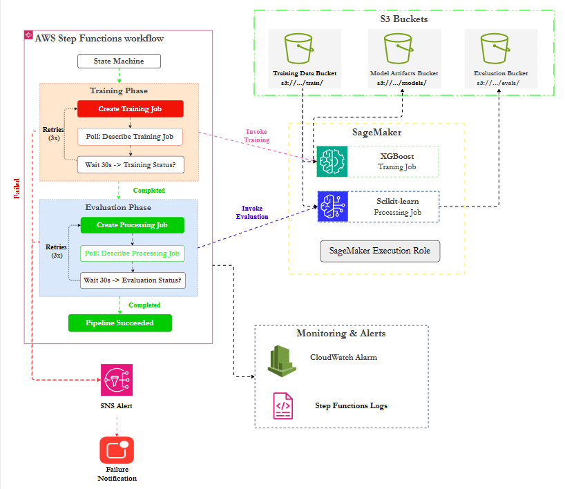
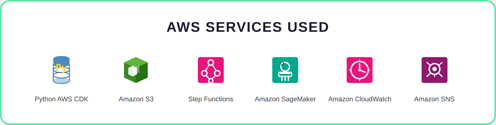

# AWS Python CDK – ML Training & Evaluation Pipeline

This repository contains a complete example of an ML training and evaluation
pipeline on AWS, built using Infrastructure as Code (IaC) with AWS CDK (Python).

The pipeline runs a SageMaker Training Job followed by a SageMaker Processing
Job for model evaluation, orchestrated by AWS Step Functions. Training data,
model artifacts, and evaluation results are stored in Amazon S3.

Failures are captured through CloudWatch Logs, CloudWatch Alarms, and SNS
notifications.

## 🖼️ DIAGRAMS

### Architecture Diagram

#### Static View



#### Animated Walkthrough


### Services Used



## 🚀 WHAT THIS PROJECT DOES

- Trains an XGBoost model using SageMaker Training Jobs
- Evaluates the trained model using SageMaker Processing Jobs
- Orchestrates training and evaluation as a single workflow using Step Functions
- Stores training data, model artifacts, and evaluation outputs in S3
- Polls job status with retry logic and exponential backoff
- Surfaces failures via CloudWatch and SNS
- Defines all infrastructure using AWS CDK (Python)

## 🤔 WHY TRAINING + EVALUATION PIPELINE

A combined training and evaluation pipeline is appropriate when:

- Model training must be followed by automated quality checks
- Evaluation metrics need to be generated alongside training
- Reproducibility and traceability of experiments are important
- The full workflow should be observable and failure-tolerant

## 🧠 ARCHITECTURE OVERVIEW

Execution flow:

1. Step Functions starts the training and evaluation workflow
2. SageMaker Training Job reads training data from S3 and trains an XGBoost model
3. Step Functions polls the training job status until completion
4. On success, a SageMaker Processing Job runs the evaluation script
5. The processing job reads model artifacts and validation data from S3
6. Evaluation results are written to S3
7. Failures at any stage are logged and generate alerts through SNS

## 🧰 AWS SERVICES USED

- AWS CDK (Python) – Infrastructure as Code
- Amazon S3 – Training data, model artifacts, and evaluation output storage
- AWS Step Functions – Workflow orchestration with polling and retries
- Amazon SageMaker – Training Jobs (XGBoost) and Processing Jobs (scikit-learn)
- Amazon CloudWatch – Logs and alarms
- Amazon SNS – Failure notifications

## 📁 REPOSITORY STRUCTURE

```text
.
├── diagrams/
│   ├── ml-a2-diagram.drawio
│   ├── ml-a2-diagram.png
│   ├── ml-a2-diagram.gif
│   ├── ml-a2-diagram.mp4
│   └── services_used.png
├── ml_a2/
│   ├── __init__.py
│   └── stack.py
├── tests/
│   ├── __init__.py
│   └── test_stack.py
├── .gitignore
├── app.py
├── cdk.json
├── LICENSE
├── README.md
└── requirements.txt

```

## 🛠️ USING THIS REPOSITORY

This project can be reviewed, synthesized, and tested without an AWS account.

Create and activate a virtual environment:

    python -m venv .venv
    .venv\Scripts\Activate.ps1

Install dependencies:

    pip install -r requirements.txt

Synthesize the infrastructure:

    npx aws-cdk@2.160.0 synth

Run tests:

    pytest -q

## 🚨 DEPLOYMENT

If you choose to deploy it, the following prerequisites apply:

- An AWS account
- AWS credentials configured locally
- CDK bootstrap executed once per account and region

      npx aws-cdk@2.160.0 bootstrap

## ⚠️ IMPORTANT DEPLOYMENT REQUIREMENTS

This project intentionally uses placeholder values so that it can be
synthesized and tested safely without deployment.

To successfully deploy and run the pipeline, you must:

1. Upload training data to:

   s3://<TrainingDataBucket>/train/

2. Upload a validation dataset to:

   s3://<TrainingDataBucket>/validation/

3. Upload the evaluation script to:

   s3://<TrainingDataBucket>/evaluation/evaluate.py

4. Ensure the container images are valid and available in your AWS region.

Default images:

       Training:   public.ecr.aws/sagemaker/sagemaker-xgboost:1.7-1
       Evaluation: 683313688378.dkr.ecr.us-east-1.amazonaws.com/sagemaker-scikit-learn:1.2-1-cpu-py3

The evaluation image URI is region-specific (us-east-1). Update it if deploying
to a different region.

If these requirements are not met, the stack may deploy but the training or
evaluation job will fail at runtime.

## 📝 DESIGN NOTES

- Training and evaluation are combined in a single Step Functions workflow
- AWS SDK integrations (CallAwsService) are used instead of CDK high-level task constructs for compatibility with aws-cdk-lib 2.160.0
- Polling loops with Choice states check job status every 30 seconds
- Both create-job steps include retry logic with exponential backoff (3 attempts)
- Failures are caught and routed to SNS at every stage
- S3 buckets use destroy-on-delete settings for easy cleanup during development
- The evaluation success branch is wired directly into the training Choice state to avoid CDK chain limitations with terminal branching states
